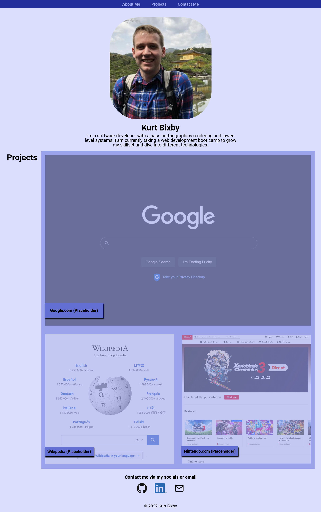

# Boot Camp Challenge 2

Description
=====
An exercise to create a portfolio webpage from scratch. Featured functionality includes a navigation bar with intra-site links, portfolio images that change color on hover and link to deployed versions of those projects, and working contact links.

Demo
=====
Here's a live deployed version of the refactored site: [https://kurtbixby.github.io/Boot-Camp-Challenge-02-Portfolio/](https://kurtbixby.github.io/Boot-Camp-Challenge-02-Portfolio/).

Notes
=====
Favicon created on [favicon.io](https://favicon.io).
Email icon sourced from [icons8.com](https://icons8.com).

Credits
=====
__[Kurt Bixby](https://github.com/kurtbixby)__ created this webpage from scratch.

Special thanks to the following people:
* __[Andrew E](https://github.com/Andrew87E)__ for having his site up first for others and me to compare against.
* _Everyone who was in the Discord voice channel or who shared resources I could reference._